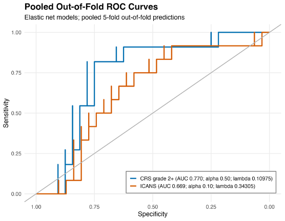
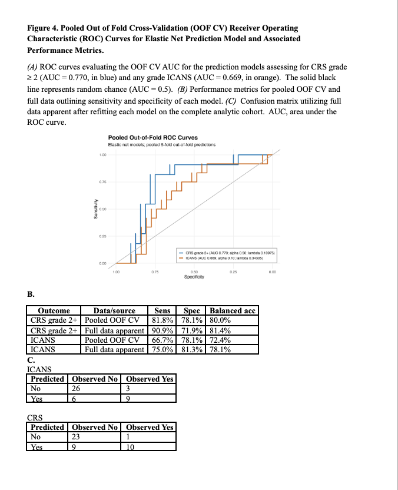

# Tarlatamab CRS and ICANS Risk Calculator

**Authors:** Wanru Guo, Graeme Fenton, Curtis Tatsuoka, and Samuel Rosner

[Open the Shiny calculator](https://wguo3.shinyapps.io/tarla_risk_calculator/) | [Zenodo software archive](https://doi.org/10.5281/zenodo.22890432)

A calculator for estimating grade 2 or higher cytokine release syndrome (CRS) and any-grade immune effector cell-associated neurotoxicity syndrome (ICANS) after tarlatamab. Separate forms allow each outcome to be calculated using its required clinical inputs. The application returns fitted model probabilities using the original preprocessing and coefficients.

## Use the calculator

1. Select CRS or ICANS.
2. Enter the clinical inputs for that outcome. The ICANS form requires age, ECOG performance status, LDH, and metastatic-site category.
3. Calculate the estimated probability. The model details view provides the fitted coefficients and thresholds.

The models were developed in a small cohort and require independent external validation. Estimates are exploratory and should not be used alone to make treatment or monitoring decisions.

## Manuscript figures

The following supplied figures report the manuscript elastic-net analyses, including pooled five-fold out-of-fold ROC curves and performance tables.



### Figure 4: ROC curves and performance metrics



## Original model coefficients

The tables show the nonzero coefficients and intercepts, rounded to three decimals. The calculator retains full precision and applies the saved preprocessing before prediction; these values should not be multiplied directly by unprocessed age or LDH values. The complete fitted models are in [models/locked_models.rds](models/locked_models.rds).

### CRS, grade 2 or higher

| Term | Coefficient |
|---|---:|
| Intercept | -1.223 |
| C1D1 LDH | +0.396 |
| Other lesions: 6 or more | +0.295 |
| Other lesions: 1-5 | -0.244 |
| Sex: female | -0.235 |
| Sex: male | +0.235 |
| Liver lesions: 6 or more | +0.189 |
| Age at C1D1 | -0.112 |

### ICANS, any grade

| Term | Coefficient |
|---|---:|
| Intercept | -1.040 |
| Metastatic sites: 3 or more | +0.300 |
| ECOG | +0.265 |
| C1D1 LDH | +0.219 |
| Age at C1D1 | +0.085 |

C1D1 means cycle 1, day 1. The metastatic-site category above follows the application's encoded category of 3 or more sites.

## Run locally

From the repository folder in R:

```r
install.packages(c("shiny", "glmnet", "caret"))
shiny::runApp()
```

The repository contains application code, fitted model parameters, and supplied manuscript figures. It contains no patient-level data.

## Citation

Guo W, Fenton G, Tatsuoka C, Rosner S. *Tarlatamab CRS and ICANS Risk Calculator*. Version 1.0.0. Zenodo; 2026. https://doi.org/10.5281/zenodo.22890432.

The Zenodo v1.0.0 archive contains the application and fitted models. This repository additionally includes the manuscript figures and coefficient tables.
